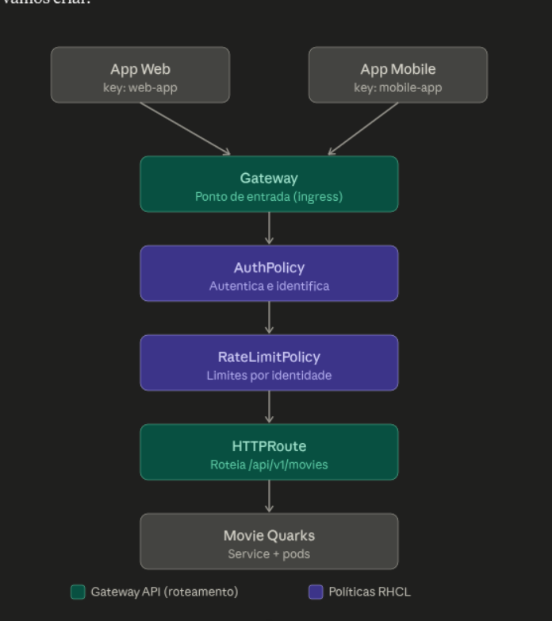

# ansible-rhcl-aws-demo

<p align="center">
  
</p>

The diagram above shows the request flow this demo builds with RHCL: the **App Web**
and **App Mobile** clients (each with its own API key) hit the **Gateway**, where the
**AuthPolicy** authenticates/identifies the caller and the **RateLimitPolicy** enforces
per-identity limits; the **HTTPRoute** then routes `/api/v1/movies` to the **Movie
Quarks** service. Teal blocks are Gateway API (routing); purple blocks are RHCL policies.

Ansible automation that bootstraps a **Red Hat Connectivity Link (RHCL / Kuadrant)**
API-gateway demo on OpenShift, on top of **OpenShift GitOps (ArgoCD)** and
**OpenShift Service Mesh 3 (Sail/Istio)**.

It installs the operators (skipping any that are already present), wires up the
Service Mesh control plane, deploys the `movies-quarkus` demo app through ArgoCD,
and creates the Gateway, HTTPRoute, AuthPolicies (deny-by-default + API-key) and
RateLimitPolicy described in [`instructions.md`](instructions.md).

---

## ⚠️ Prerequisite: you must be logged into the cluster

Everything runs against **your current `oc` / kubeconfig context**. Before running
anything, log into the target cluster:

```bash
oc login --token=<token> --server=https://api.<cluster>:6443
# verify:
oc whoami
oc whoami --show-server
```

You need **cluster-admin** (operator installation creates cluster-scoped
Subscriptions, OperatorGroups and CRDs). The playbook fails fast in the
`preflight` role if you are not logged in.

---

## What gets installed

| Component | Operator (package) | Namespace | Channel / Catalog |
|-----------|--------------------|-----------|-------------------|
| OpenShift GitOps | `openshift-gitops-operator` | `openshift-operators` | `latest` / redhat-operators |
| Service Mesh 3 | `servicemeshoperator3` | `openshift-operators` | `stable` / redhat-operators |
| Red Hat Connectivity Link | `rhcl-operator` | **`kuadrant-system`** | `stable` / redhat-operators |

> RHCL is installed into its own **`kuadrant-system`** namespace (its own
> OperatorGroup), as requested. RHCL depends on **cert-manager**, which is
> expected to already be present on the cluster.
>
> The RHCL **web-console plugin** (`kuadrant-console-plugin`) is enabled
> automatically by adding it to the cluster Console operator config (it is not
> enabled by the operator install on its own). Existing console plugins are
> preserved.

Custom resources created:

- `Kuadrant/kuadrant` in `kuadrant-system`
- `Istio/default` (→ `istio-system`) and `IstioCNI/default` (→ `istio-cni`)
- ArgoCD `Application/movies-quarkus` (deploys the Helm chart into `cinema`)
- `Gateway/ingress-gateway` in `api-gateway`
- One `HTTPRoute/movies-quarkus` in `cinema` carrying all endpoints:
  - `/api/v1/movies`, `/api/v1/movies/drama`, `/api/v1/movies/comedia` (GET/POST)
  - `/api/v1/directors` (GET)
  - `/q/openapi` (public OpenAPI spec)
- `AuthPolicy` deny-all on the Gateway, plus a single route policy
  `movies-quarkus-auth` that differentiates behaviour per path with `when`
  predicates:
  - `/q/openapi` → **public** (anonymous; overrides the deny-all)
  - `/api/v1/directors` → **web-app only** (other identities get 403)
  - everything else → any valid API key
- Per-app API-key `Secret`s in `kuadrant-system` (`web-app`, `mobile-app`)
- `RateLimitPolicy/movies-quarkus-rlp` on the route (per-identity limits)

> **One HTTPRoute, one AuthPolicy — why not named rules + `sectionName`?**
> Targeting an individual HTTPRoute *rule* by name (`sectionName`) is an
> **experimental** Gateway API feature. OpenShift ships the **standard** Gateway
> API channel (managed by the cluster ingress-operator), where route rules cannot
> be named, so the apiserver prunes rule names and `sectionName` targeting fails
> with `TargetNotFound`. Instead we keep a single route and put all the
> per-endpoint logic inside one AuthPolicy, selecting rules with `when`
> (`request.path`) predicates — same behaviour, standard Gateway API.
>
> **Note:** only `/q/openapi` (the OpenAPI spec) is exposed publicly. To also
> expose the Swagger UI, add a `{ type: PathPrefix, value: /q/swagger-ui }` match
> to `route_matches` in `group_vars/all.yml` (and `/q/swagger-ui` to the
> `public` rule's `when` predicate).

---

## Requirements (control machine)

- `oc` CLI, logged in (see above)
- `ansible-core` (tested with 2.18)
- Python `kubernetes` client library
- Ansible collections from `requirements.yml`

```bash
ansible-galaxy collection install -r requirements.yml
# if the kubernetes python lib is missing:
pip install kubernetes
```

---

## Usage

Run the whole thing:

```bash
ansible-playbook main.yml
```

Run only parts of it with tags:

```bash
ansible-playbook main.yml --tags preflight    # read-only connectivity checks
ansible-playbook main.yml --tags operators    # install/verify the 3 operators
ansible-playbook main.yml --tags gitops        # just OpenShift GitOps
ansible-playbook main.yml --tags mesh          # Service Mesh operator + Istio CRs
ansible-playbook main.yml --tags rhcl,kuadrant # RHCL operator + Kuadrant CR + secrets
ansible-playbook main.yml --tags console       # enable the RHCL web-console plugin
ansible-playbook main.yml --tags demo-app      # ArgoCD Application only
ansible-playbook main.yml --tags gateway,auth,ratelimit  # routing + policies
ansible-playbook main.yml --tags observability # UWM + Kuadrant metrics + Grafana
```

The `preflight` and `info` roles always run.

---

## Idempotency / "is it already installed?"

Before creating a Subscription, the `olm_operator` role queries the existing
`ClusterServiceVersion`s in the operator namespace. If one matching the operator
is already present, it **skips** the Subscription/OperatorGroup creation and just
waits for it to be `Succeeded`. Re-running the playbook is safe — all custom
resources are applied declaratively.

---

## Things you will likely need to confirm / tweak

Edit [`group_vars/all.yml`](group_vars/all.yml):

- **`app_service_name`** (default `movies-quarkus`) — the HTTPRoute backend points
  here. After ArgoCD syncs the Helm chart, confirm the real Service name:
  ```bash
  oc get svc -n cinema
  ```
- **`demo_app.path`** (default `chart`) and **`demo_app.value_files`**
  (default `values/values-dev.yaml`, relative to the chart path) — the Helm
  chart location inside
  [movies-quarkus-devops](https://github.com/rh-bcordeir/movies-quarkus-devops).
  If the values file lives at the repo root, use `../values/values-dev.yaml`.
- **`gateway_class`** (default `istio`) — uses Service Mesh. Set to
  `openshift-default` to instead use the built-in OpenShift Gateway controller
  (the playbook then creates the `openshift-default` GatewayClass and skips the
  Service Mesh control-plane CRs).
- **`api_keys`** — the demo keys `CHAVE_DO_APP_WEB` / `CHAVE_DO_APP_MOBILE`.
  Change these for anything beyond a throwaway demo.

---

## Testing the demo

After a successful run, the `info` role prints the AWS LoadBalancer hostname and
ready-to-paste `curl` commands. The LB may take a minute to provision:

```bash
oc get svc -n api-gateway          # wait for an EXTERNAL-IP / hostname

GW=http://<lb-hostname>

# Denied by default (no key):
curl -i $GW/api/v1/movies

# Allowed with an API key:
curl -i -H 'Authorization: APIKEY CHAVE_DO_APP_WEB' $GW/api/v1/movies

# Rate limit — mobile is 2 req / 10s, should start returning 429:
for i in $(seq 1 6); do
  curl -s -o /dev/null -w "%{http_code}\n" \
    -H 'Authorization: APIKEY CHAVE_DO_APP_MOBILE' $GW/api/v1/movies
done

# Rate limit — web is 5 req / 10s, should start returning 429:
for i in $(seq 1 8); do
  curl -s -o /dev/null -w "%{http_code}\n" \
    -H 'Authorization: APIKEY CHAVE_DO_APP_WEB' $GW/api/v1/movies
done
```

> If the deny-all AuthPolicy does not take effect, roll out the controller as the
> instructions note:
> `oc rollout restart deploy/kuadrant-operator-controller-manager -n kuadrant-system`

---

## Observability

The `observability` role (tag `observability`, toggle `enable_observability`)
wires up the RHCL metrics pipeline so you can see traffic/auth/rate-limit
metrics in Grafana. It:

1. **Enables User Workload Monitoring** — merges `enableUserWorkload: true` into
   `cluster-monitoring-config` in `openshift-monitoring` (existing settings are
   preserved), which brings up the user-workload Prometheus.
2. **Turns on Kuadrant observability** — sets `spec.observability.enable: true`
   on the `Kuadrant` CR, which creates the component/gateway
   `ServiceMonitor`s/`PodMonitor`s (including in `api-gateway`).
3. **Installs the Kuadrant metrics exporter + dashboards** via the upstream
   kustomize bundles:
   - `kube-state-metrics-kuadrant` (produces the `gatewayapi_*` metrics) + the
     operator `ServiceMonitor`s. The `gateway-system not found` errors it prints
     are **expected** and ignored — the operator already created equivalent
     monitors in `api-gateway`.
   - the example Kuadrant dashboards.
4. **Tags the HTTPRoute** with `service: movies-quarkus` and
   `deployment: movies-quarkus` so kube-state-metrics can join route state with
   the Envoy/Istio traffic metrics. (The route is named `movies-quarkus` to match
   the Service — Istio aggregates traffic metrics by Service, not by route.)
5. **Deploys Grafana** — a plain `Deployment` + `Service` + edge `Route` in the
   `grafana` namespace, with a `grafana-service-account` bound to
   `cluster-monitoring-view`. The three dashboard JSONs in the repo root are
   loaded into `ConfigMap`s in that namespace.

> **You still configure the Grafana datasource manually.** Point it at the
> in-cluster Thanos:
> `https://thanos-querier.openshift-monitoring.svc.cluster.local:9091`, auth =
> Bearer token of the `grafana-service-account` (it has `cluster-monitoring-view`),
> with TLS skip-verify (or the cluster CA). Then import the dashboards from the
> `ConfigMap`s. Validate end-to-end against Thanos, e.g.
> `count({__name__=~"gatewayapi_.+"}) > 0` and `count(istio_requests_total) > 0`,
> and check **Observe → Targets** are `Up`.
>
> Pin `kuadrant_observability_kustomize` / `kuadrant_dashboards_kustomize` in
> `group_vars/all.yml` to the refs that match your installed RHCL version.

---

## Layout

```
main.yml                 # orchestrator playbook
group_vars/all.yml       # all tunables
inventory.yml            # localhost (runs against your kubeconfig)
requirements.yml         # Ansible collections
roles/
  preflight/             # verify oc login, python k8s lib, Gateway API CRDs
  olm_operator/          # generic, idempotent OLM operator installer
  console_plugins/       # enable the RHCL web-console plugin
  kuadrant/              # Kuadrant CR + API-key secrets
  mesh/                  # Istio + IstioCNI control plane (Service Mesh 3)
  demo_app/              # ArgoCD Application (movies-quarkus)
  gateway/               # Gateway, HTTPRoute, AuthPolicies, RateLimitPolicy
  observability/         # UWM, Kuadrant metrics, kube-state-metrics, Grafana
  info/                  # prints endpoint + test commands
```
